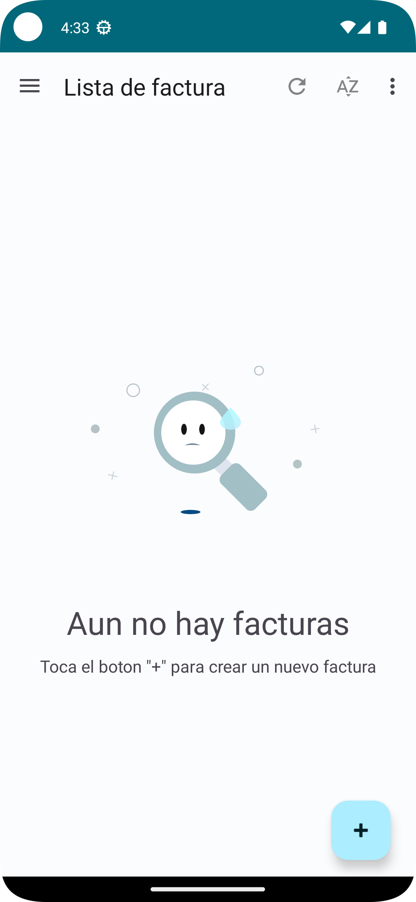
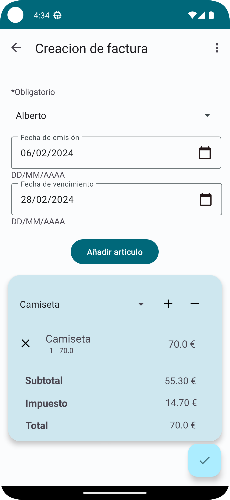
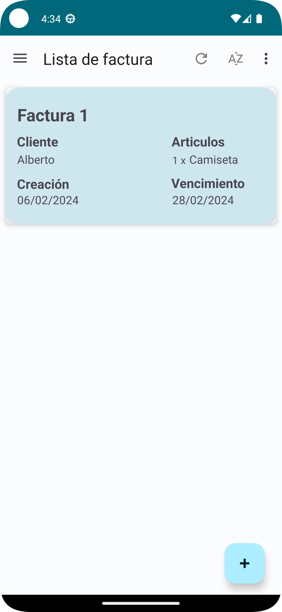
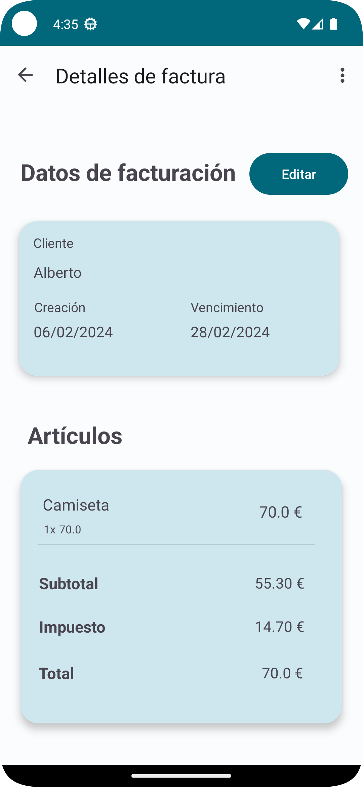
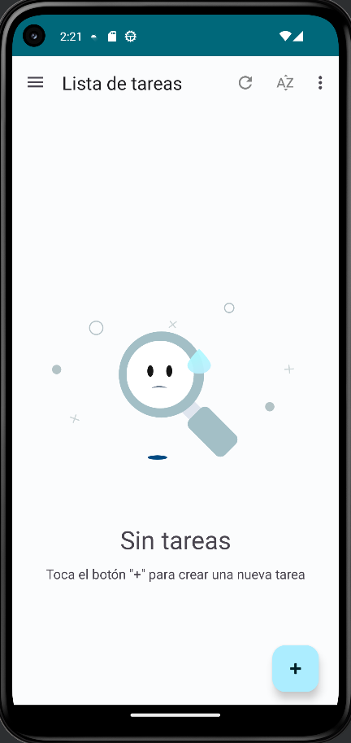
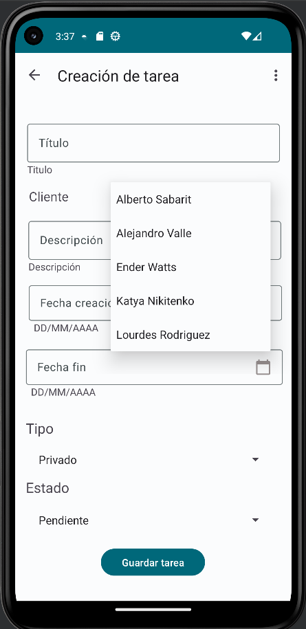
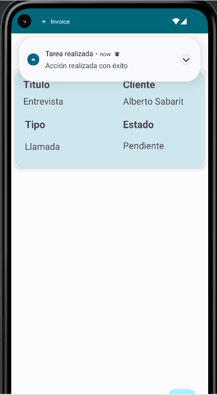

# Invoice 🧾

Invoice es una aplicación para gestionar clientes, artículos, facturas y tareas, desarrollada como
parte de la asignatura de ✨DEINT✨.

## Características

- Desarrollada con módulos dinámicos.
- Aplicación desarrollada según el patrón MVVM.
- Navegación a fragmentos de forma directa y con Navigation Drawer.
- Preferencias de la aplicación para personalizar la visualización de las entidades ordenandola por
  diferentes criterios.
- La aplicación utiliza Room, el framework de persistencia de datos proporcionado por Android
  Jetpack, para gestionar la base de datos local.

## Entidades y Funcionalidades

### Cliente

- **Responsable**: Alejandro Valle Rodríguez
- [x] Creación de clase POJO (Customer) y repositorio para la base de datos
- [x] Creación de repositorio volátil para Customer (Obsoleto)
- [x] Creación de Adapter
- [x] Operaciones CRUD en la base de datos local sobre la entidad Customer
- [x] Creacion de 4 fragment para realizar las operaciones CRUD
    - [x] CustomerListFragment con MVVM para listar clientes
    - [x] CustomerCreationFragment con MVVM para crear clientes
    - [x] CustomerEditFragment con MVVM para editar y actualizar clientes
    - [x] CustomerDetailFragment con para mostrar los datos de los clientes
- [x] Implementación de toolbar con opciones de ordenar Customer por nombre o email
- [x] Implementación de preferencias relacionadas con Customer
- [x] Implementación voluntaria de un mapa usando la API de Google Maps
- [x] Implementación de TextWatchers para los fragmentos dedicados a crear y editar
- [x] Implementación de notificaciones al crear, borrar (solo exitosamente) y editar clientes
- [x] Implementación de BaseFragmentDialog al no poder borrar un cliente con el fin de dar un error
  más visible al usuario
- [x] Creación de pruebas unitarias para la clase POJO Customer
- [x] Primer diseño de la pantalla principal de la app, posteriormente mejorado por Katya

### Artículo

- **Responsable**: Ender Watts García
- [x] Listar, agregar, editar y eliminar artículos
- [x] Restricción a la hora de eliminar artículos referenciados en facturas
- [x] Uso de diálogos para preguntar al usuario si quiere borrar el artículo
- [x] Uso del patrón MVVM
    - [x] Visualización de la lista de artículos
        - [x] Uso de RecyclerView y ListAdapter
    - [x] Creación y edición de artículos
    - [x] Visualización de los datos detallados del artículo
    - [x] Uso de mensaje de errores y TextWatchers en TextInputLayouts
- [x] Notificaciones al crear, editar y eliminar artículos
- [x] Implementación de data class POJO Item
    - [x] Pruebas unitarias para Item
- [x] Uso de base de datos con Room
- [x] Preferencias
    - [x] Ordenar lista de artículos por nombre o precio
    - [x] Idioma de la aplicación
- [x] Implementación de imágenes para los artículos

### Facturas

- **Responsable**: Kateryna Nikitenko
- [x] Creación de clase POJO (Invoice, LineItems) y repositorios para la base de datos
- [x] Implementación de operaciones CRUD(Listar, añadir, actualizar y eliminar)
- [x] Pruebas unitarias para las clases(Invoice y LineItems)
- [x] Notificaciones cuando se crea y se borra la factura
- [x] Ordenar facturas por cliente o por la fecha de cración
- [x] Preferencias relacionadas con Invoice
- [x] Preferencias el modo oscuro y claro para la aplicación

  
  
  
  

### Tareas

- **Responsable**: Alberto Sabarit Peñalosa

- [x] Creación de la data class Task
- [x] Creación e implementación de TaskDao y TaskRepository para poder insertar las tareas en la base de datos(Room).
- [x] Implementación de operaciones CRUD(Listar, añadir, actualizar y eliminar) para la entidad de
  tarea en la base de datos local. Así como un fragment para poder visualizar los detalles de la tarea. Tanto crear como listar están realizado con sus respectivos ViewModel.
- [x] Pruebas unitarias para la clase Task testeada al 100% usando mockito.
- [x] Envío de notificaciones dentro de la aplicación para informar cuando se crea, edita o se borra una tarea.
- [x] Ordenar tareas en la toolbar según título o cliente
- [x] Ordenar tareas en según preferencias según título o cliente.

- [x] Supervisión del proyecto desde el inicio del mismo. Proporcionando ayuda a cada uno de mis compañeros, supervisando cambios, proponiendo ideas y conceptos para el proyecto. Así como ir marcando los plazos del mismo para cumplir con las fechas con la calidad requerida.
- [x] Realizado todo lo que no corresponde a los módulos de cada integtrante del equipo, como puede ser lo relacionado con Account, User y App.

  
  
  

## Créditos

Este proyecto fue desarrollado por el equipo compuesto por Alejandro Valle Rodríguez, Ender Watts
García, Kateryna Nikitenko y Alberto Sabarit Peñalosa.

